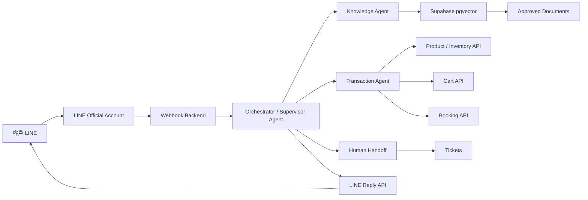
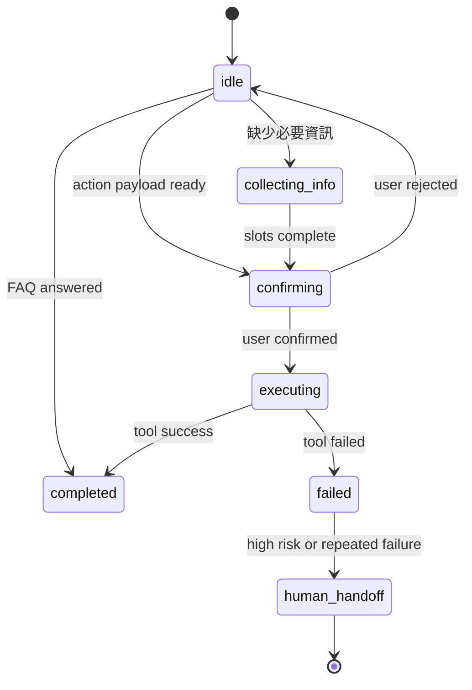
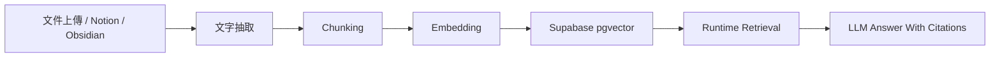
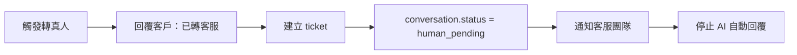

# LINE OA Agentic Workflow 開發規格

本文件給 AI coding agent / 工程團隊使用，目標是開發一套「LINE Official Account 客服入口 + RAG 知識庫 + Agentic Workflow + 真人接手」系統。

## 1. 產品目標

建立一個 LINE OA AI 客服系統，讓客戶可以透過 LINE 詢問問題、查文件、查商品、加入購物車、預約服務或建立 ticket。系統不只是 chatbot，而是可控的 agentic workflow：LLM 負責理解自然語言與協助判斷，真正的業務操作由後端 workflow 與明確定義的 tools 執行。

核心原則：

- LINE OA 是客戶入口。
- 後端 Orchestrator 是主控者。
- Agent 不直接改 database，不直接操作不受控網站。
- RAG 只查 approved documents。
- 高風險操作必須轉真人或要求使用者明確確認。
- 每次 tool call 都要留下 audit log。

## 2. MVP Scope

第一版只做「可營運、可觀察、可擴充」的最小系統。

### In Scope

- LINE Messaging API webhook
- 驗證 LINE signature
- 儲存 conversation 與 messages
- Single Orchestrator / Supervisor：intent routing 與流程狀態管理
- Knowledge capability：先以 RAG tool 實作 SOP / FAQ / 產品文件查詢
- Transaction capability：先以 action tool 實作，例如 `addToCart`
- Confirmation Gate：狀態變更前要求使用者確認
- Human Handoff：建立 ticket，停止 AI 自動回覆
- Supabase 作為 database、storage、pgvector
- 基本後台資料結構，先不一定做完整 UI

### Out of Scope for MVP

- 自動付款
- 自動退款
- 自動取消訂單
- 直接操作第三方網站的 browser agent
- 多語言完整支援
- 複雜客服排班
- 完整文件審核 workflow

## 3. 高階架構



## 3.1 Implementation Stance：先 Single Agent，後 Multi-Agent

這個 LINE OA 建置計畫的終態可以演進成 multiple agents，但第一版不應直接開發成多個獨立 agent runtime。建議採用：

```text
Phase 1:
Single Orchestrator Agent
+ RAG tool
+ Transaction tools
+ Handoff tool
+ Audit log

Phase 2:
Single Orchestrator
+ More tools
+ richer workflow state
+ admin dashboard

Phase 3:
Multi-agent, only if needed
+ Supervisor Agent
+ Knowledge Agent
+ Transaction Agent
+ Support / Handoff Agent
```

給外包或 AI coding agent 的正確表述：

```text
請開發一個 LINE OA Agentic Workflow 系統。
第一版採用 single orchestrator agent + tool-calling architecture。
系統需預留未來拆成 multi-agent 的介面。
```

不要一開始寫成「請開發 multi-agent 系統」，否則容易導致過度設計、工期拉長、debug 困難、成本增加，以及使用者體驗變慢。

### 什麼時候才拆成真正 Multi-Agent

只有出現以下痛點時，才把角色拆成多個獨立 agents：

- 工具太多，單一 orchestrator 經常選錯 tool。
- 不同任務需要完全不同的 system prompt。
- 交易、預約、客服接手流程變得很複雜。
- 某些任務需要不同模型或不同安全邊界。
- 需要平行處理多個子任務。
- 高風險能力需要隔離，例如交易 / 付款 / 內部系統操作。

### Related Technical Background

這兩份 EnGenie 文件是本案的技術地基，但不應取代本規格：

- [單一 Agent 架構：從純 RAG 到工具導向 Agent](https://engenie-eg.vercel.app/docs/agent-architecture.html)
  - 對應本案 Phase 1。
  - 重點是 RAG 只是 tool 之一，不是固定主流程。
  - LLM 透過 tool calling 決定查文件、查 API 或執行工具。
- [多 Agent 架構：Multi-Agent](https://engenie-eg.vercel.app/docs/multi-agent-architecture.html)
  - 對應本案 Phase 3。
  - 重點是何時才需要拆 agent，以及 supervisor / agent-as-tool / pipeline / handoff 等 topology。
  - 在本案中，只有當工具太多或風險邊界變複雜時才採用。

## 4. 推薦 Tech Stack

- Frontend / Admin：Next.js + React + TypeScript
- Backend：Next.js Route Handler 或 Cloudflare Workers
- Database：Supabase Postgres
- Vector Search：Supabase pgvector
- File Storage：Supabase Storage
- LLM：OpenAI / Claude / Gemini 任一 provider，需包成 adapter
- Queue / Jobs：Supabase Edge Functions、QStash、BullMQ 或 Cloudflare Queues
- Notification：Slack、Email、LINE 內部通知 bot 任一

## 4.1 技術架構與資料庫選型

LINE OA Agentic Workflow 不是純前端網站，必須有後端 server 或 serverless backend。原因是 LINE Messaging API 會把事件送到 webhook，且系統需要保護 LINE channel secret、LINE access token、LLM API key、資料庫 service role key，以及交易 / ticket / audit 的後端邏輯。

### 必要元件

```text
LINE OA / Messaging API
→ Webhook Backend
  → Signature Verification
  → Message Logging
  → Orchestrator Service
    → Router / Workflow State
    → RAG Retriever
    → Tool Executor
    → Human Handoff
  → Database / Vector DB / File Storage / Queue
→ LINE Reply or Push API
```

### 後端 Server 選項

| 選項 | 適合情境 | 優點 | 注意事項 |
|---|---|---|---|
| Next.js Route Handler / API Routes | MVP、中小型正式產品 | 前台、後台、API 同 repo，開發快 | 長任務需要 queue，不要卡 webhook |
| Cloudflare Workers | 低延遲 webhook、全球部署 | 快、便宜、部署簡單 | Node 套件相容性、複雜後台較不直覺 |
| NestJS / Express | Node 後端服務 | 結構清楚，適合複雜 service layer | 初期工程量較高 |
| FastAPI | Python 團隊或 AI pipeline 偏 Python | 文件處理與 ML tooling 友善 | 前端後台通常還要另建 |

建議 MVP：`Next.js + Supabase`。如果 webhook 延遲要求很高，再考慮把 webhook edge layer 放到 Cloudflare Workers。

### 主資料庫

主資料庫負責儲存可交易與可稽核的資料：

- LINE user profile
- conversations
- messages
- workflow_states
- tickets
- tool_calls
- audit_events
- documents metadata

選項：

| 選項 | 建議程度 | 說明 |
|---|---:|---|
| Supabase Postgres | 高 | 同時支援 Postgres、Auth、Storage、pgvector，MVP 最省事 |
| Neon Postgres | 中 | Serverless Postgres 體驗好，但 Storage / Auth 要另外搭 |
| Railway Postgres | 中 | 開發快，但正式權限與備援要另評估 |
| PlanetScale | 中低 | 適合 MySQL 生態，但 RAG / pgvector 整合不如 Postgres 直覺 |

建議：使用 Supabase Postgres。

### Vector DB / RAG

RAG 不應該 runtime 才處理文件。文件 ingestion 應該預先完成：

```text
文件上傳 / Notion / Obsidian
→ text extraction
→ chunking
→ embedding
→ vector index
→ runtime retrieval
```

選項：

| 選項 | 適合情境 | 優點 | 限制 |
|---|---|---|---|
| Supabase pgvector | MVP 到中型文件量 | 跟 Postgres metadata 同庫，開發簡單 | 超大量或高 QPS 可能需要優化 |
| Qdrant | 文件量較大、需要獨立 vector service | 開源、效能好、metadata filter 清楚 | 需要額外部署與維護 |
| Pinecone | 想使用 managed vector DB | 維運少、擴充方便 | 成本與 vendor lock-in |
| Weaviate | 搜尋需求複雜 | 功能完整 | 初期複雜度較高 |

建議 MVP：Supabase pgvector。

### File Storage

原始文件要保存，不能只保存 chunks。

用途：

- 重新 indexing
- 文件版本控管
- 人工審核
- 追查回答來源

選項：

- Supabase Storage：MVP 推薦
- AWS S3：企業雲端標準
- Cloudflare R2：成本友善，適合 public assets 或大量檔案
- Google Cloud Storage：若其他系統在 GCP

### Queue / Background Jobs

LINE webhook 應該快速回應，不應等待慢任務完成。以下任務應進 queue 或 background job：

- 文件文字抽取
- chunking / embedding
- Notion / Obsidian sync
- 重新 indexing
- 長時間 tool call
- ticket notification
- 定期統計與報表

選項：

| 選項 | 適合情境 |
|---|---|
| Supabase Edge Functions / Cron | 簡單背景任務 |
| QStash | Serverless queue，適合 Vercel |
| Cloudflare Queues | Workers 架構 |
| BullMQ + Redis | 複雜 job pipeline、自架 Node worker |

MVP 可以先用簡單 background function，但架構上要預留 queue。

### Admin UI / 後台

正式團隊使用時需要後台。最小功能：

- 文件上傳 / reindex
- 文件分類與狀態
- conversation list
- ticket list
- ticket detail
- 真人客服回覆框
- audit timeline
- routing rule 設定

建議：Next.js admin dashboard + Supabase Auth。

### 推薦 MVP 組合

```text
Next.js
→ /api/line/webhook
→ Orchestrator service
→ Supabase Postgres
→ Supabase pgvector
→ Supabase Storage
→ OpenAI / Claude adapter
→ LINE Reply / Push API
```

此組合最適合第一版，因為它可以用單一 repo 快速完成：

- LINE webhook
- RAG
- conversation state
- ticket
- audit log
- admin dashboard

### 不建議省略的技術元件

- LINE signature verification
- Workflow state
- Audit events
- Tool call log
- Confirmation gate
- Queue / background job 預留
- Admin dashboard

## 5. Agent Team

本章的 `Supervisor Agent`、`Knowledge Agent`、`Transaction Agent` 是責任邊界。MVP 可以先實作成一個 Orchestrator service 裡的模組與 tools，不必拆成三個獨立 agent runtime。

### 5.1 Supervisor Agent

職責：

- 判斷使用者 intent
- 決定 route 到 Knowledge、Transaction 或 Human Handoff
- 檢查是否需要追問
- 管理 workflow state
- 偵測高風險場景
- 控制是否允許 AI 自動回覆

不能做：

- 不能直接呼叫交易 tool
- 不能直接改 database
- 不能自行承諾退款、合約、法律、付款結果

輸入：

```ts
type SupervisorInput = {
  lineUserId: string
  conversationId: string
  message: string
  conversationStatus: "ai_active" | "human_pending" | "human_active" | "resolved"
  currentWorkflowState?: WorkflowState
  customerContext?: CustomerContext
}
```

輸出：

```ts
type SupervisorDecision = {
  intent:
    | "faq_question"
    | "product_search"
    | "add_to_cart"
    | "booking"
    | "ticket_purchase"
    | "human_handoff"
    | "unknown"
  action:
    | "answer_with_rag"
    | "ask_clarifying_question"
    | "prepare_transaction"
    | "request_confirmation"
    | "execute_confirmed_action"
    | "handoff_to_human"
  risk: "low" | "medium" | "high"
  reason: string
  requiredSlots?: string[]
  filters?: KnowledgeFilters
}
```

### 5.2 Knowledge Agent

職責：

- 根據問題與 metadata filters 查詢文件 chunks
- 只根據 approved documents 回答
- 回傳引用來源
- 找不到足夠資料時回報 `insufficient_context`

輸入：

```ts
type KnowledgeInput = {
  query: string
  filters?: {
    department?: "support" | "sales" | "finance" | "product" | "legal"
    category?: string
    productLine?: string
    visibility?: "public_customer" | "internal" | "agent_only"
    language?: "zh-TW" | "en"
  }
}
```

輸出：

```ts
type KnowledgeOutput = {
  status: "answered" | "insufficient_context"
  answer?: string
  citations: Array<{
    documentId: string
    title: string
    chunkId: string
    score: number
  }>
}
```

### 5.3 Transaction Agent

職責：

- 處理商品、購物車、預約、票券、訂單等 action
- 只呼叫白名單 tools
- 在執行會改變狀態的操作前，產生 confirmation draft
- tool 執行失敗時回報 Supervisor

不能做：

- 不能跳過確認直接下單、預約、購票或付款
- 不能自行處理退款、法律、合約、客訴

## 6. Workflow State

每個 conversation 必須有狀態，避免 Agent 每次訊息都重新判斷而忘記前一步。

```ts
type WorkflowState = {
  conversationId: string
  currentIntent:
    | "faq_question"
    | "product_search"
    | "add_to_cart"
    | "booking"
    | "ticket_purchase"
    | "human_handoff"
    | "unknown"
  step:
    | "idle"
    | "collecting_info"
    | "confirming"
    | "executing"
    | "completed"
    | "failed"
  collectedSlots: Record<string, unknown>
  pendingAction?: {
    name: string
    payload: unknown
    confirmationText: string
    expiresAt: string
  }
  lastDecisionReason?: string
}
```

狀態轉移：



## 7. Routing Rules

Hard rules 優先，LLM classifier 次之。

| 條件 | Route | 動作 |
|---|---|---|
| conversation.status = `human_active` | Human | AI 不回覆，只記錄並通知客服 |
| 包含退款、客訴、法律、合約、付款失敗 | Human Handoff | 建 ticket |
| RAG score 低於門檻 | Human Handoff 或追問 | 不要亂答 |
| intent = `faq_question` | Knowledge Agent | 查文件回答 |
| intent = `product_search` | Transaction Agent | 查商品 / 庫存 / 價格 |
| intent = `add_to_cart` | Transaction Agent | 先確認再加入購物車 |
| intent = `booking` | Transaction Agent | 收集時段 / 人數 / 場地後確認 |
| 連續 2 次 unknown | Human Handoff | 建 ticket |

## 8. Tool Contracts

所有 tools 都應該有明確 schema、權限與 audit log。

```ts
type ToolCall<TInput, TOutput> = {
  name: string
  input: TInput
  requiresConfirmation: boolean
  execute: (input: TInput) => Promise<TOutput>
}
```

### 8.1 searchKnowledgeBase

```ts
type SearchKnowledgeBaseInput = {
  query: string
  filters?: KnowledgeFilters
  limit?: number
}
```

### 8.2 searchProducts

```ts
type SearchProductsInput = {
  query: string
  category?: string
  limit?: number
}
```

### 8.3 addToCart

```ts
type AddToCartInput = {
  lineUserId: string
  productId: string
  variantId?: string
  quantity: number
}
```

規則：

- `requiresConfirmation = true`
- 執行前必須回覆使用者確認商品、規格、數量、價格
- 使用者回覆「確認 / 好 / 可以 / 是」後才執行

### 8.4 createBooking

```ts
type CreateBookingInput = {
  customerId: string
  venueId: string
  date: string
  timeSlot: string
  partySize: number
}
```

規則：

- `requiresConfirmation = true`
- 預約成功後回覆預約編號
- 若時段已被搶走，回覆替代時段或轉真人

### 8.5 createHumanTicket

```ts
type CreateHumanTicketInput = {
  conversationId: string
  lineUserId: string
  reason: string
  priority: "low" | "normal" | "high" | "urgent"
  summary: string
}
```

## 9. Database Schema 草案

### conversations

```sql
create table conversations (
  id uuid primary key default gen_random_uuid(),
  line_user_id text not null,
  status text not null check (status in ('ai_active', 'human_pending', 'human_active', 'resolved')),
  assigned_team text,
  assigned_agent_id uuid,
  handoff_reason text,
  created_at timestamptz not null default now(),
  updated_at timestamptz not null default now()
);
```

### messages

```sql
create table messages (
  id uuid primary key default gen_random_uuid(),
  conversation_id uuid not null references conversations(id),
  sender_type text not null check (sender_type in ('customer', 'ai', 'human_agent', 'system')),
  content text not null,
  raw_payload jsonb,
  created_at timestamptz not null default now()
);
```

### workflow_states

```sql
create table workflow_states (
  conversation_id uuid primary key references conversations(id),
  current_intent text not null,
  step text not null,
  collected_slots jsonb not null default '{}',
  pending_action jsonb,
  last_decision_reason text,
  updated_at timestamptz not null default now()
);
```

### documents

```sql
create table documents (
  id uuid primary key default gen_random_uuid(),
  title text not null,
  source_type text not null check (source_type in ('upload', 'notion', 'obsidian', 'manual')),
  department text,
  category text,
  product_line text,
  visibility text not null default 'public_customer',
  status text not null default 'approved',
  storage_path text,
  created_at timestamptz not null default now(),
  updated_at timestamptz not null default now()
);
```

### document_chunks

```sql
create table document_chunks (
  id uuid primary key default gen_random_uuid(),
  document_id uuid not null references documents(id),
  chunk_index int not null,
  content text not null,
  metadata jsonb not null default '{}',
  embedding vector(1536),
  created_at timestamptz not null default now()
);
```

### tool_calls

```sql
create table tool_calls (
  id uuid primary key default gen_random_uuid(),
  conversation_id uuid not null references conversations(id),
  message_id uuid references messages(id),
  tool_name text not null,
  input jsonb not null,
  output jsonb,
  status text not null check (status in ('pending_confirmation', 'executed', 'failed', 'cancelled')),
  confirmed_by_user_message_id uuid references messages(id),
  created_at timestamptz not null default now(),
  executed_at timestamptz
);
```

### audit_events

Audit log 建議用獨立 `audit_events` 表儲存，並在後台做成「稽核紀錄」頁。它不是給客戶看的，而是給客服主管、營運、工程與管理者追查每次 AI 判斷、人工接手、狀態變更與 tool call。

```sql
create table audit_events (
  id uuid primary key default gen_random_uuid(),
  conversation_id uuid references conversations(id),
  ticket_id uuid,
  actor_type text not null check (actor_type in ('customer', 'ai_agent', 'human_agent', 'system')),
  actor_id text,
  event_type text not null,
  event_summary text not null,
  metadata jsonb not null default '{}',
  created_at timestamptz not null default now()
);
```

應記錄的事件：

- inbound LINE message
- outbound LINE reply / push
- Supervisor routing decision
- RAG retrieval result 與 citations
- pending action created
- user confirmation received
- tool call started / succeeded / failed
- ticket created / assigned / resolved
- conversation status changed
- human agent reply

### tickets

```sql
create table tickets (
  id uuid primary key default gen_random_uuid(),
  conversation_id uuid not null references conversations(id),
  priority text not null default 'normal',
  category text,
  summary text not null,
  status text not null default 'open',
  assigned_team text,
  assigned_agent_id uuid,
  created_at timestamptz not null default now(),
  updated_at timestamptz not null default now()
);
```

## 10. API Endpoints

### POST /api/line/webhook

職責：

- 驗證 LINE signature
- 解析 message event
- 建立或取得 conversation
- 儲存 customer message
- 呼叫 Orchestrator
- 用 LINE Reply API 回覆

Pseudo flow：

```ts
if (!verifyLineSignature(req)) {
  return new Response("Unauthorized", { status: 401 })
}

const event = parseLineEvent(req)
const conversation = await getOrCreateConversation(event.source.userId)
await saveMessage(conversation.id, "customer", event.message.text, event)

if (conversation.status === "human_active") {
  await notifyAssignedAgent(conversation, event.message.text)
  return ok()
}

const result = await orchestrator.handleMessage({
  lineUserId: event.source.userId,
  conversationId: conversation.id,
  message: event.message.text
})

await replyToLine(event.replyToken, result.replyText)
return ok()
```

### POST /api/admin/documents

上傳文件，建立 `documents` 記錄，將原始檔放到 Supabase Storage。

### POST /api/admin/documents/:id/reindex

抽文字、chunking、embedding、寫入 `document_chunks`。

### POST /api/admin/conversations/:id/assign

將 conversation 改成 `human_active`，指定客服或團隊。

### POST /api/admin/conversations/:id/resolve

結案，必要時恢復 `ai_active`。

## 11. RAG Pipeline



文件 ingestion 規則：

- 每份文件需有 `department`、`category`、`visibility`、`status`
- 只有 `status = approved` 的文件可被 Knowledge Agent 查詢
- chunk 建議 500 到 1000 tokens
- 每個回答至少保留 citations
- RAG score 低於門檻時不要回答，改追問或轉真人

## 12. Confirmation Gate

所有會改變狀態、產生費用或影響客戶權益的工具都要通過確認。

需要確認的動作：

- 加入購物車
- 建立預約
- 保留票券
- 建立訂單
- 取消訂單
- 付款

MVP 只允許加入購物車或預約，不做付款。

確認訊息格式：

```text
我找到以下項目：

商品：黑色 M 號外套
數量：2
單價：NT$1,200
小計：NT$2,400

請回覆「確認」後，我再幫你加入購物車。
```

## 13. Human Handoff

觸發條件：

- 客戶要求退款、賠償、取消合約
- 客訴、辱罵、明顯不滿
- 法律、合約、個資、付款爭議
- Agent 找不到可信答案
- 連續 2 次 intent = unknown
- tool call 失敗且影響客戶權益
- conversation 已經由真人接手

流程：



真人接手不是把客服的個人 LINE 帳號 tag 進客戶對話。客戶端仍然只看到 LINE OA；內部則由客服後台、LINE OA Manager、Slack 或 Email 通知真人處理。系統需要把 `conversation.status` 改成 `human_pending` 或 `human_active`，確保後續訊息不再由 AI 自動回覆。

後台案件頁建議顯示：

- 客戶最近訊息
- AI 判定的 handoff reason
- 對話摘要
- 已查過的文件 citations
- 建議負責部門
- ticket priority
- conversation status
- audit timeline

## 13.1 Audit Log / 稽核紀錄

Audit log 建議做在 admin dashboard 的兩個位置：

1. Conversation / Ticket 詳情頁右側時間軸，讓客服看這筆案件的完整脈絡。
2. 全域 Audit 頁，讓主管或工程用條件查詢，例如 `event_type`、`actor_type`、`conversation_id`、`ticket_id`、時間區間。

Audit log 的用途：

- 客服主管檢查 AI 是否過度轉真人或錯誤回答。
- 營運 / PM 分析常見問題與 SOP 缺口。
- 工程 debug routing、RAG score、tool call error。
- 管理者追查誰在什麼時間改了狀態、回了客戶或執行了工具。

## 13.2 使用者體驗與反應速度要求

LINE 對話體驗的核心不是「所有任務都瞬間完成」，而是不要讓使用者等在黑洞裡。系統必須在短時間內提供明確狀態，讓使用者知道目前正在查資料、等待確認、執行工具或轉真人。

體驗目標：

| 時間 | 系統行為 | 目的 |
|---|---|---|
| 0-1 秒 | 顯示 loading animation 或先回短訊息 | 讓使用者知道系統有收到 |
| 1-3 秒 | 完成 hard rules 與 intent routing | 快速判斷 FAQ、交易、預約或轉真人 |
| 3-5 秒 | 回覆結論、選項或確認卡片 | 避免長時間無回應 |
| 5 秒以上 | 分段回覆「仍在處理」，完成後 push 結果 | 避免使用者以為系統壞掉 |

加速策略：

- 文件 embedding 必須預先建立，runtime 不做文件切分與 embedding。
- 常見 FAQ、保固、營業時間、付款方式可以 cache。
- customer profile、conversation state、RAG retrieval、商品庫存應平行查詢。
- 第一層 routing 用 hard rules + 輕量 classifier，不要所有訊息都直接丟給大型模型。
- 回覆內容要適合 LINE，優先短句、選項與 quick replies。
- 高風險問題快速轉真人，不要讓 AI 長時間嘗試解決退款、客訴、付款爭議。

## 13.3 Ticket / Case Management 要求

如果系統需要正式真人客服接手，必須有 ticket 或 case management 概念。MVP 可以自建輕量 ticket 模組，不一定一開始導入 Zendesk、Intercom、Freshdesk 或 Salesforce Service Cloud。

Ticket 系統負責回答這些問題：

- 這是哪個客戶？
- 為什麼 AI 轉真人？
- 現在誰負責？
- 案件處理到哪一步？
- 客戶上一句說什麼？
- AI 查過哪些文件？
- 客服回了什麼？
- 什麼時候結案？

最小 ticket 後台需要：

- 待處理案件列表
- 案件詳情
- 對話紀錄
- AI 摘要
- handoff reason
- 指派客服或 team
- 客服回覆輸入框
- 結案按鈕
- audit timeline

Ticket 狀態建議：

```text
open
assigned
waiting_customer
waiting_internal
resolved
closed
```

Conversation 與 ticket 的關係：

```text
conversation.status = ai_active
→ AI 可以自動回覆

conversation.status = human_pending
→ 已建立 ticket，等待客服接手，AI 不再自行回答高風險內容

conversation.status = human_active
→ 真人正在處理，AI 不回客戶，只做摘要或內部輔助

conversation.status = resolved
→ 案件結束，可視情況恢復 ai_active
```

## 14. Prompt Guidelines

### Supervisor Agent System Prompt

```text
你是 LINE OA agentic workflow 的 Supervisor Agent。
你的任務是判斷使用者意圖、管理流程狀態、選擇下一步。
你不能直接執行交易工具，也不能承諾退款、法律、合約或付款結果。
如果問題涉及退款、客訴、法律、合約、付款失敗，請 route 到 human_handoff。
如果資訊不足，請產生一個簡短澄清問題。
如果需要執行會改變狀態的動作，請要求 confirmation gate。
```

### Knowledge Agent System Prompt

```text
你是 Knowledge Agent。
你只能根據系統提供的 approved document chunks 回答。
如果文件中沒有足夠資訊，請回傳 insufficient_context，不要猜測。
回答要適合 LINE 訊息閱讀，簡短、清楚、避免過長。
```

### Transaction Agent System Prompt

```text
你是 Transaction Agent。
你只能使用系統提供的 tools。
任何加入購物車、預約、購票、訂單或付款相關操作，都必須先取得使用者明確確認。
如果工具回傳錯誤、庫存不足、價格不一致或付款問題，請回報 Supervisor 轉真人。
```

## 15. Evals / 測試案例

至少建立以下 eval cases：

| Case | Input | Expected |
|---|---|---|
| FAQ | 「保固多久？」 | route 到 Knowledge Agent，回答附 citations |
| Low confidence | 「你們老闆電話多少？」 | insufficient context 或轉真人 |
| Add to cart | 「我要買黑色 M 號兩件」 | 查商品，產生確認訊息，不直接加入 |
| Confirm action | 「確認」 | 執行 pending addToCart |
| Refund | 「我要退款」 | 轉真人，建立 ticket |
| Human active | 任意訊息 | AI 不回覆，通知客服 |
| Unknown twice | 連續兩次無法分類 | 建 ticket |

## 16. 建置順序

1. 建立 LINE OA webhook 與 signature 驗證。
2. 建立 Supabase schema：conversations、messages、workflow_states。
3. 實作 message logging。
4. 實作 single Orchestrator service 與 Supervisor intent classifier。
5. 建立 documents、document_chunks 與 RAG pipeline。
6. 實作 Knowledge capability，MVP 先做成 `searchKnowledgeBase` tool。
7. 實作一個 Transaction tool，例如 `addToCart`。
8. 實作 confirmation gate。
9. 實作 human handoff 與 tickets。
10. 加入 admin dashboard。
11. 加入 eval tests。
12. 擴充 booking、ticket purchase、order lookup。
13. 只有在工具與流程複雜度明顯上升後，才拆成真正 multi-agent runtime。

## 17. 開發時的關鍵限制

- 不要讓 LLM 直接寫入 database。
- 不要讓 LLM 自行產生 SQL 後執行。
- 不要讓 Agent 自行決定付款、退款、取消訂單。
- 不要在沒有 citations 的情況下回答政策、規格、保固。
- 不要在 conversation.status = `human_active` 時讓 AI 回客戶。
- 所有 tool call 必須寫入 `tool_calls`。
- 所有 inbound / outbound LINE message 必須寫入 `messages`。

## 18. 給 AI Coding Agent 的執行指令

請依本文件建立一個 MVP。優先完成可跑通的核心流程：

```text
LINE webhook
→ message log
→ single Orchestrator routing
→ Knowledge RAG tool
→ one Transaction tool
→ confirmation gate
→ human handoff
```

MVP 不要直接實作成多個獨立 agents。請先採用 single orchestrator agent + tool-calling architecture，並把 Knowledge、Transaction、Handoff 設計成可被未來抽成 agents 的模組 / tools。

請先產出：

- 專案結構建議
- database migration
- LINE webhook handler
- orchestrator service
- agent interfaces
- tool interfaces
- RAG service
- 至少 7 個 eval / test cases

如果既有專案已存在，請優先沿用既有 framework、style、database client 與部署方式，不要重建整套架構。
